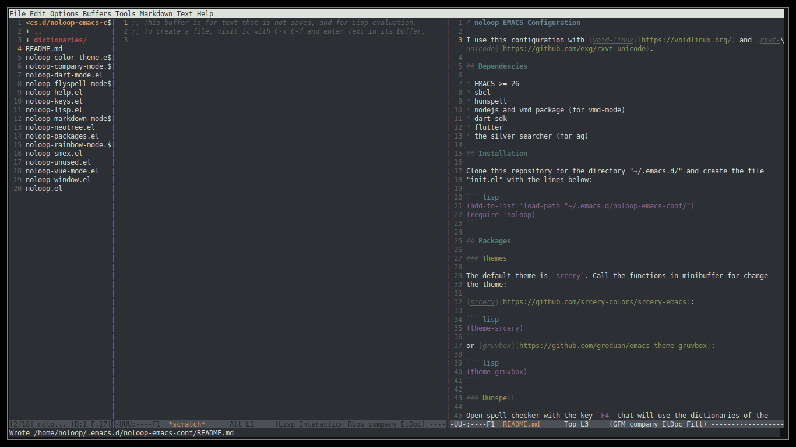

# noloop-refuge



I use this configuration with [void-linux](https://voidlinux.org/) and [rxvt-unicode](https://github.com/exg/rxvt-unicode).

## Dependencies

* EMACS >= 26
* sbcl
* hunspell
* nodejs and vmd package (for vmd-mode)
* dart-sdk
* flutter
* the_silver_searcher (for ag)
* next (Browser)
* xclip

## Installation 

Clone this repository for the directory "~/.emacs.d/" and create the file 
"init.el" with the lines below:

``` lisp
(add-to-list 'load-path "~/noloop-refuge/emacs.d/")
(require 'noloop)
```
and change the content of the Next configuration file in "~/.config/next/init.lisp":

``` lisp
(in-package :next)

(load "~/noloop-refuge/next.d/init.lisp")
```

Configure in the `.bashrc` file:

```bash
alias next='export $(dbus-launch); firejail --ignore=nodbus next'
# export dbus-launch in emacs for next development
alias emacs='export $(dbus-launch); emacs' 
```
Configuring ASDF to find your systems:

Create the file 
`~/.config/common-lisp/source-registry.conf.d/50-noloop-lisp-dev.conf` 
for the ASDF also find in the **/home/noloop/lisp-dev/** directory containing the line below:

``` lisp
(:tree "/home/noloop/lisp-dev/")
```

## Color picker

To use color picker, call `M-x <RET> noloop-color-picker <RET>`.

## Packages

### Themes

The default theme is `srcery`. Call the functions in minibuffer for change
the theme:

[srcery](https://github.com/srcery-colors/srcery-emacs):

``` lisp
`M-x <RET> noloop-theme-srcery <RET>`
```
or [gruvbox](https://github.com/greduan/emacs-theme-gruvbox):

``` lisp
`M-x <RET> noloop-theme-gruvbox <RET>`
```

### Hunspell

Open spell-checker with the key `F4` that will use the dictionaries of the 
"~/.emacs.d/noloop-emacs-conf/dictionaries/" directory.
Dictionaries available by default:

* brasileiro
* english

### company-mode

The [company-mode](http://company-mode.github.io/) is a text completion 
framework for Emacs. 
The global-company-mode is enabled by default after init the EMACS.
Use for select: `M-n` to next and `M-p` to previous.
When the completion candidates are shown, press `F1` to display the 
documentation for the selected candidate, or `C-w` to see its source. 
Not all back-ends support this.

### neotree

The [neotree](https://github.com/jaypei/emacs-neotree) is a tree plugin.

Open/close neotree with the key `F8`.

### rainbow-mode

The [rainbow-mode](https://github.com/emacsmirror/rainbow-mode) serves to
colorize color names in buffers.
By default the `rainbow-mode` is enabled for `css-mode` and `emacs-lisp-mode`.
For active in other modes, call:

``` lisp
(rainbow-mode)
```
or add new hook in the file `noloop-rainbow-mode.el`.

### markdown-mode

The [markdown-mode](https://github.com/jrblevin/markdown-mode) is enabled by 
default in "README.md" (github favored), "*.md" and ".markdown" files.

### vmd-mode

The [vmd-mode](https://github.com/blak3mill3r/vmd-mode) is a fast 
Github-flavored Markdown previews synchronized with changes to an 
emacs buffer (no need to save).
Depends of nodejs and vmd package installed.
Open/close new preview windown with the key `F3`.

### dart-mode and flutter

The [dart-mode](https://github.com/bradyt/dart-mode) is an Emacs mode for the Dart language and for use the [flutter](https://github.com/amake/flutter.el).
Depends of [dart-sdk](https://dart.dev/) and [flutter](https://flutter.dev/) installed.
For change the path of the dart-sdk and flutter, visit the "noloop-dart-mode.el" file.

### mmm-mode and vue-mode

The [mmm-mode](https://github.com/purcell/mmm-mode) is a minor mode for Emacs that allows Multiple Major Modes 
to coexist in one buffer.
The [vue-mode](https://github.com/AdamNiederer/vue-mode) is Emacs major mode 
for vue.js based on mmm-mode.

### slime

The [SLIME](https://github.com/slime/slime)is the Superior Lisp Interaction Mode for Emacs. 
The slime-mode will automatically come up in every ".lisp" file.
For change the inferior-lisp-program (default is "/bin/sbcl") visit the "noloop-slime.el" file.
To fire up SLIME, connect to a Lisp and get a friendly REPL, use `M-x slime`.

### slime-company

The [company-mode](https://github.com/anwyn/slime-company) is the completion backend for Slime.
The company-mode will automatically come up in slime.

### smex

The [smex](https://github.com/nonsequitur/smex) is a M-x enhancement for 
Emacs. Built on top of Ido, it provides a convenient interface to your 
recently and most frequently used commands. 
And to all the other commands, too.
The smex is enabled by default when use `M-x`.
And the smex-major-mode-commands with `M-X` (runs Smex, limited to commands 
that are relevant to the active major mode. Try it with Dired or Magit.).
For use normal of the `M-x` use `C-c C-c M-x`.

### ag

The [ag](https://github.com/Wilfred/ag.el) is an Emacs frontend to 
The Silver Searcher.
Depends of the package "the_silver_searcher" (in void-linux, in other system 
the name can be different) for the ag works. 
Use the function "ag" in `M-x`.

### multiple-cursors-mode

The [multiple-cursors-mode](https://github.com/magnars/multiple-cursors.el)
is enabled with `C-c m` in mode `edit-lines`.
Use `C-c .` for mark next like this.
Use `C-c ,` for mark previous like this.
Use `M-;` for mark all like this (userful to refatore all words in the buffer).

To get out of multiple-cursors-mode, press <return> or C-g. The latter will first disable multiple regions before
disabling multiple cursors. 

### xclip-mode

Copy/paste from terminal to external program.

## Commands 

For change the commands visit the "~/.emacs.d/noloop-emacs-conf/noloop-keys.el" file.

### F-keys

#### F3

Open/close vmd-mode. This will open one new window for current markdown buffer.

#### F4

Open/close spell-checker. This will ask which dictionary to use before.

#### F8

Open/close neotree-toggle.

### C-x C-keys

#### C-x C-e

Load "~/.emacs.d/init.el" file.

#### C-x o

Go to other window.

#### C-x p

Go to preview window.

### C-c C-keys

#### C-c C-a

Move to left window.

#### C-c C-d

Move to right window.

#### C-c C-w

Move to up window.

#### C-c C-s

Move to down window.

#### C-c C-x

Quit EMACS.

### C-c keys

#### C-c 0

Change neotree directory to "~/.emacs.d/noloop-emacs-conf/".

#### C-c 1

Change neotree directory to "~/lisp-dev/". 

#### C-c 2

Change neotree directory to "~/dart-dev/". 

#### C-c 3

Change neotree directory to "~/javascript-dev/". 

#### C-c m

In multiple-cursors-mode. Is enabled with `C-c m` in mode `edit-lines`.

#### C-c .

In multiple-cursors-mode. Use to mark next like this.

#### C-c ,

In multiple-cursors-mode. Use to for mark previous like this.

### M-keys

#### M-;

In multiple-cursors-mode. Use to mark all like this.

### C-u Keys

#### C-u M-x align

To align the columns of selection text or all text when unselected.

## Help

To get help while using, call the noloop-help in `M-x`.
Example:

`M-x noloop-help <RET> smex <RET>` for receive a help about smex.

or `M-x noloop-help <RET> C-c C-x <RET>` for receive a help about a specific command.

or also `M-x noloop-help <RET> something <RET>` to go to the position of this sequence of words.q 

